# Pulse — AI Agent Monitor

Qt6/QML 悬浮覆层，监控 AI 编码 Agent（Claude Code、Codex、OpenCode）。支持 macOS、Linux (Wayland/Hyprland)、Windows (stub)。

---

## 变更记录 (Changelog)

| 日期 | 变更 |
|------|------|
| 2026-05-30 | 初次生成 CLAUDE.md；全模块扫描 |

---

## 项目愿景

Pulse：轻量桌面覆层，实时显 AI Agent 状态（工作/待权/提问/计划），覆层内直接批准/拒绝，无需切终端。

---

## 架构总览

```
┌─────────────────────────────────────────────────────────────────┐
│  ProcScanner (2s 轮询)                                           │
│    ProcessTree (platform impl: linux/macos/win)                 │
│    → 发现 claude / codex 进程                                    │
└──────────────────────┬──────────────────────────────────────────┘
                       │ QVector<AgentInfo>
                       ▼
┌─────────────────────────────────────────────────────────────────┐
│  enrichAgents()                                                  │
│    ClaudeMetaReader → ~/.claude/sessions/<pid>.json             │
│                     → ~/.claude/projects/<enc-cwd>/<sid>.jsonl  │
│    CodexMetaReader  → ~/.codex/sessions/                        │
│    TmuxResolver     → tmux list-panes / list-clients            │
│    WindowManager    → Hyprland IPC / macOS NSRunningApplication │
└──────────────────────┬──────────────────────────────────────────┘
                       │ enriched AgentInfo
                       ▼
┌─────────────────────────────────────────────────────────────────┐
│  AgentModel (QAbstractListModel)                                 │
│    globalState: idle | working | permission | question | plan    │
│    Q_INVOKABLE: answerQuestion / approvePlan / decidePermission  │
└──────────────────────┬──────────────────────────────────────────┘
                       │ QML context property "agentModel"
                       ▼
┌─────────────────────────────────────────────────────────────────┐
│  QML Engine                                                      │
│    main.qml (Window) → HeaderBar + Loader                       │
│    Loader:                                                       │
│      PermissionView | QuestionView | PlanView | ExpandedView    │
└─────────────────────────────────────────────────────────────────┘
```

### 状态机 (PulseState)

```
Idle ←→ Working ←→ Permission
                ←→ Question
                ←→ Plan
```

### IPC (pulse-toggle)

```
pulse-toggle toggle|show|hide  →  QLocalSocket("pulse-ipc")  →  main pulse process
```

---

## 模块结构图

```mermaid
graph TD
    ROOT["(根) vibe-pulse"] --> SRC["src/"];
    ROOT --> QML["qml/"];
    ROOT --> TOGGLE["pulse-toggle/"];
    ROOT --> OPENSPEC["openspec/"];
    ROOT --> PROTOCOLS["protocols/"];
    ROOT --> ASSETS["assets/"];

    SRC --> CORE["核心逻辑"];
    SRC --> PLATFORM["平台层"];
    SRC --> READERS["Agent 读取器"];

    CORE --> AgentInfo["AgentInfo.h\n(数据模型)"];
    CORE --> AgentModel["AgentModel.h/cpp\n(QAbstractListModel)"];
    CORE --> ProcScanner["ProcScanner.h/cpp\n(进程扫描)"];
    CORE --> ProcessTree["ProcessTree.h\n(跨平台进程树)"];
    CORE --> Settings["Settings.h/cpp\n(主题/形状持久化)"];
    CORE --> SubscriptionMonitor["SubscriptionMonitor\n(API 用量监控)"];
    CORE --> ResponseWriter["ResponseWriter\n(写回 Agent 决策)"];
    CORE --> MiniMd["MiniMd\n(Markdown→HTML)"];

    READERS --> ClaudeReader["ClaudeMetaReader\n(解析 JSONL)"];
    READERS --> CodexReader["CodexMetaReader"];

    PLATFORM --> WindowManager["WindowManager\n(抽象 WM 接口)"];
    PLATFORM --> Hyprland["HyprlandWindowManager\n(Linux)"];
    PLATFORM --> MacOS["MacOSWindowManager\n(macOS)"];
    PLATFORM --> Null["NullWindowManager\n(Windows/fallback)"];
    PLATFORM --> WaylandLS["WaylandLayerShell\n(Linux only)"];
    PLATFORM --> WindowOverlay["WindowOverlay\n(置顶层接口)"];

    QML --> MainQML["main.qml\n(根 Window)"];
    QML --> HeaderBar["HeaderBar.qml\n(标题栏/状态指示)"];
    QML --> ExpandedView["ExpandedView.qml\n(所有 Agent 列表)"];
    QML --> PermissionView["PermissionView.qml"];
    QML --> QuestionView["QuestionView.qml"];
    QML --> PlanView["PlanView.qml"];
    QML --> Theme["Theme.qml\n(Singleton 主题)"];

    TOGGLE --> ToggleMain["pulse-toggle/main.cpp\n(IPC 客户端)"];

    click SRC "./src/CLAUDE.md" "查看 src 模块文档"
    click QML "./qml/CLAUDE.md" "查看 qml 模块文档"
    click TOGGLE "./pulse-toggle/CLAUDE.md" "查看 pulse-toggle 文档"
    click OPENSPEC "./openspec/CLAUDE.md" "查看 openspec 文档"
```



---

## 模块索引

| 模块 | 路径 | 职责 |
|------|------|------|
| 核心 C++ 后端 | `src/` | 进程扫描/状态读取/模型/平台接口 |
| QML 前端 | `qml/` | 覆层UI：标题栏/视图/主题 |
| IPC 控制工具 | `pulse-toggle/` | CLI客户端，发 show/hide/toggle |
| 变更规格文档 | `openspec/changes/` | 功能设计/提案/任务文档 |
| Wayland 协议 | `protocols/` | `wlr-layer-shell-unstable-v1.xml`（Wayland层shell协议） |
| 静态资源 | `assets/` | CC/Codex 图标 |

---

## 运行与开发

### 前置依赖

| 平台 | 依赖 |
|------|------|
| 全平台 | Qt6 >= 6.4（Core / Gui / Qml / Quick / Network）、CMake >= 3.16、C++17 |
| Linux | `wayland-client`、`wayland-scanner`、Hyprland（可选） |
| macOS | Xcode CLT、AppKit、Foundation（Homebrew Qt6） |
| Windows | MSVC 2022、psapi |

### 构建命令

```bash
make build        # cmake --build build[_mac|_win] --target pulse
make run          # build + 启动 pulse
make toggle       # build pulse-toggle + 发送 toggle 指令
make clean        # 删除 build 目录

# Mock 场景预览（不依赖真实 Agent 进程）
make mock-idle
make mock-working
make mock-permission
make mock-question
make mock-plan
make mock-expanded
make mock-subscription   # 模拟订阅用量 CC=45% CD=31%
```

### 环境变量

| 变量 | 说明 |
|------|------|
| `PULSE_MOCK=<scene>` | 注入 mock 快照（idle/working/permission/question/plan/expanded） |
| `PULSE_DEMO=1` | 演示模式：跳过meta，仅扫进程 |
| `PULSE_MOCK_SUBSCRIPTION=CC=N,CD=N` | mock订阅用量% |

### macOS 特殊步骤

CMake 自动通过 `brew --prefix qt` 找Qt，路径不同时：
```bash
cmake -B build_mac -S . -DCMAKE_PREFIX_PATH=/opt/homebrew/opt/qt -DCMAKE_BUILD_TYPE=Release
```

---

## 测试策略

无自动化测试（无 `tests/`）。质量验证：

1. **Mock**：`make mock-<scene>` 覆盖全UI状态，视觉验证
2. **编译**：`make build` 无错（C++静态检查）
3. **真实运行**：启动真实Agent后运pulse验证状态

---

## 编码规范

详见 `.context/prefs/coding-style.md`，核心：

- 函数 < 50 行，嵌套 ≤ 3 层
- 平台代码放 `_linux.cpp`/`_macos.cpp`/`_win.cpp`，不用 `#ifdef` 污染共享文件
- Git 提交遵循 Conventional Commits + emoji 前缀
- 不记录 secrets 到日志
- 决策追加至 `.context/history/`

---

## AI 使用指引

1. **改码前**必读 `.context/prefs/coding-style.md` + `.context/prefs/workflow.md`
2. **功能变更**走 openspec：`openspec/changes/<feature>/` 建 proposal→design→tasks
3. **平台修改**：Linux→`ProcessTree_linux.cpp`，macOS→`ProcessTree_macos.cpp`，共享→`ProcessTree.h`
4. **QML改**：`make mock-<scene>` 验视觉
5. **Mock**：覆盖全 `PulseState`，添新状态同步更新 `buildMockSnapshot()`
6. **IPC 格式**：`pulse-ipc` QLocalSocket，JSON payload `{"cmd": "toggle"|"show"|"hide"}`